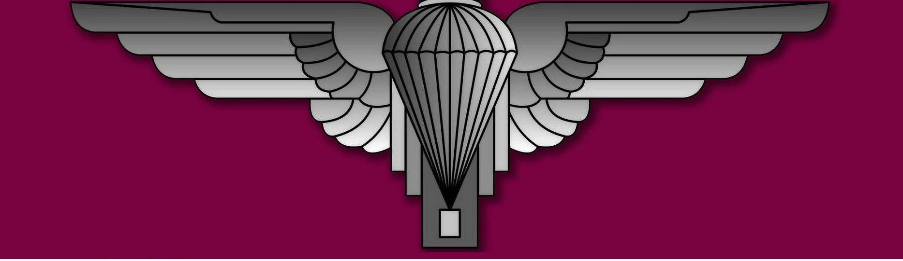
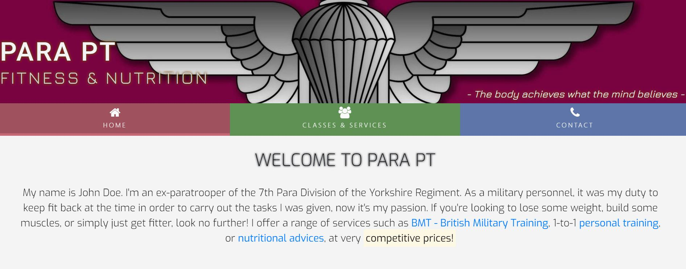

<h1 align="center">Para-Fitness</h1>

[View the live project here.](https://ernie1980.github.io/PARA-FITNESS/index.html)

This project was inspired by a close friend of mine, who after leaving the paras, started his own personal trainer business.

<h2 align="center"></h2>

## User Experience (UX)

-   ### User stories

    -   #### First Time Visitor Goals

        1. As a First Time Visitor, I want to easily understand the main purpose of the site and learn more about the organisation.
        2. As a First Time Visitor, I want to be able to easily navigate throughout the site to find content.
        3. As a First Time Visitor, I want to locate their social media links to see their followings on social media to determine how trusted and known they are.

    -   #### Returning Visitor Goals

        1. As a Returning Visitor, I want to find information about the services offered and their prices.
        2. As a Returning Visitor, I want to find the best way to get in contact with the organisation with any questions I may have.
        3. As a Returning Visitor, I want to find community links.

    -   #### Frequent User Goals
        1. As a Frequent User, I want to check to see if there are any newly added services.
        2. As a Frequent User, I want to be able to book a class.

-   ### Design
    -   #### Colour Scheme
        -   I've used subtle, pastel colours mainly, that are not harsh, but still colourful enough to catch your attention.
    -   #### Typography
        -   I've used Roboto, Exo and Jura fonts throughout the whole website with Sans Serif as the fallback font in case for any reason the font isn't being imported into the site correctly.
            I've found these 3 fonts complimenting each other well.
    -   #### Imagery
        -   The large paratrooper hero image is designed to be striking and catch the user's attention.

## Features

-   Responsive on all device sizes

-   Interactive elements

## Technologies Used

### Languages Used

-   [HTML5](https://en.wikipedia.org/wiki/HTML5)
-   [CSS3](https://en.wikipedia.org/wiki/Cascading_Style_Sheets)

### Frameworks, Libraries & Programs Used

1. [Bootstrap 4.4.1:](https://getbootstrap.com/docs/4.4/getting-started/introduction/)
    - Bootstrap was used to assist with the responsiveness and styling of the website.
1. [Hover.css:](https://ianlunn.github.io/Hover/)
    - Hover.css was used on the navigation bar items.
1. [Google Fonts:](https://fonts.google.com/)
    - Google fonts were used to import the Roboto, Jura and Exo fonts into the style.css file which is used on all pages throughout the project.
1. [Font Awesome:](https://fontawesome.com/)
    - Font Awesome was used on all pages throughout the website to add icons for aesthetic and UX purposes.
1. [jQuery:](https://jquery.com/)
    - jQuery came with Bootstrap to create the sign up modal.
1. [Git](https://git-scm.com/)
    - Git was used for version control by utilizing the Gitpod terminal to commit to Git and Push to GitHub.
1. [GitHub:](https://github.com/)
    - GitHub is used to store the projects code after being pushed from Git.

## Testing

The W3C Markup Validator and W3C CSS Validator Services were used to validate every page of the project to ensure there were no syntax errors in the project.

-   [W3C CSS Validator](https://jigsaw.w3.org/css-validator/#validate_by_input)

### Testing User Stories from User Experience (UX) Section

-   #### First Time Visitor Goals

    1. As a First Time Visitor, I want to easily understand the main purpose of the site and learn more about the organisation.

        1. Upon entering the site, users are automatically greeted with a clean and easily readable navigation bar to go to the page of their choice. 
        2. The main points are made immediately with the logo image and the introduction. 
        3. The user also has the options to click on any of the call to action links to reach other pages.

    2. As a First Time Visitor, I want to be able to easily be able to navigate throughout the site to find content.

        1. The site has been designed to be fluid and never to entrap the user. At the top of each page there is a clean navigation bar, each link describes what the page they will end up at clearly.
        2. On the Classes & Services page, after a form response is submitted, the page refreshes and the user is brought to the top of the page where the navigation bar is.

    3. As a First Time Visitor, I want to locate their social media links to see their following on social media to determine how trusted and known they are.
        1. The user can scroll to the bottom of any page on the site to locate social media links in the footer.

-   #### Returning Visitor Goals

    1. As a Returning Visitor, I want to find information about the services offered and their prices.

        1. These are clearly shown on the Classes & Services page (also accessible from the landing page via links).
        2. The user also have the option here to sign up to any of the classes.

    2. As a Returning Visitor, I want to find the best way to get in contact with the organisation with any questions I may have.

        1. The navigation bar clearly highlights the "Contact" Page.
        2. Here they can find email, phone and Skype contact details. 
        3. The footer contains links to the organisation's socail media accounts.
        4. Whichever link they click, it will be open up in a new tab to ensure the user can easily get back to the website.
    3. As a Returning Visitor, I want to find community links.
        1. All social media links can be found in the footer.
-   #### Frequent User Goals

    1. As a Frequent User, I want to check to see if there are any newly added services

        1. This would be accessible from the landing page or the Classes & Services page.

    2. As a Frequent User, I want to be able to book a class.
        1. On the Classes & Services page the user can Sign Up to any of the classes after clicking on the Sign Up button and filling in and submitting the sign up form.
### Further Testing

-   The Website was tested on Google Chrome, Microsoft Edge and Safari browsers.
-   The website was viewed on a variety of devices such as Desktop, Laptop, iPad Air, Huawei P20 and Samsung S8 phones.
-   A large amount of testing was done to ensure that all pages were linking correctly.
-   Friends and family members were asked to review the site to point out any bugs and/or user experience issues.

### Known Bugs

-   On some small mobile devices the sign up button is pushed to the side slightly.

## Deployment

### GitHub Pages

The project was deployed to GitHub 

## Credits

### Code

-   [Bootstrap4](https://getbootstrap.com/docs/4.4/getting-started/introduction/): Bootstrap Library used throughout the project mainly to make site responsive using the Bootstrap Grid System.

### Content

-   All content was written by the developer.
-   Snippets and code fragramnets were used from previous Code Institute course work

### Media

-   The paratrooper logo has been downloaded from free sources

### Acknowledgements

-   My Mentor for continuous helpful feedback.

-   Tutor support at Code Institute for their support.